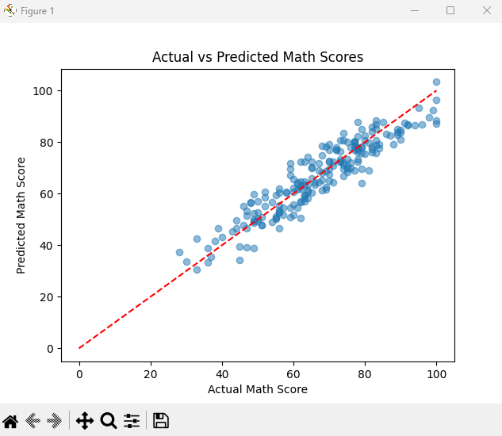
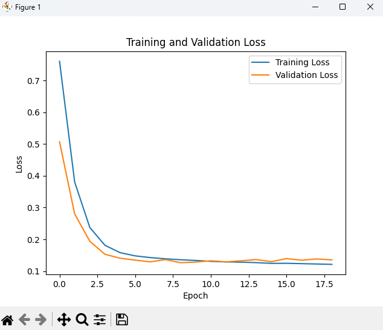

# Student Performance Prediction using LSTM

This project explores how deep learning techniques, specifically LSTM (Long Short-Term Memory) networks, can be used to predict student academic performance based on historical, time-dependent data such as grades, attendance, and activity logs.

## Project Objective
To leverage sequential academic data to forecast student performance, enabling early identification of at-risk students and supporting data-driven educational interventions.

## Dataset Source 
- Source [Kaggle](https://www.kaggle.com/datasets/auswalld/student-performance-dataset)

## Tools & Technologies

- **Python** (Jupyter Notebook)
- `Pandas`, `NumPy` – data processing
- `Seaborn`, `Matplotlib` – data visualization
- `TensorFlow / Keras` – LSTM model
- `scikit-learn` – train-test split, metrics

## Workflow

1. Load and inspect dataset
2. Normalize and reshape time-series data
3. Create LSTM input sequences
4. Split data into training and test sets
5. Build and train LSTM model
6. Evaluate predictions and visualize trends

## Key Outcomes
- Trained and validated LSTM model with high accuracy on sequential input data.
- Visualized training performance and prediction trends.
- Demonstrated potential for proactive academic support systems.

## Results
- The LSTM model achieved a low **Root Mean Squared Error (RMSE)** and high correlation between predicted and actual student performance.
- The model was able to learn temporal dependencies in student exam patterns.

| Metric       | Value       |
|--------------|-------------|
| MSE          | 12.45       |
| RMSE         | 3.52        |
| MAE          | 2.85        |

### Prediction vs Actual
The chart below shows how closely the model’s predictions align with the actual final scores.

### Loss Curve
Shows how the model minimized error over training epochs.

### Further visuals and observations to be added soon!

